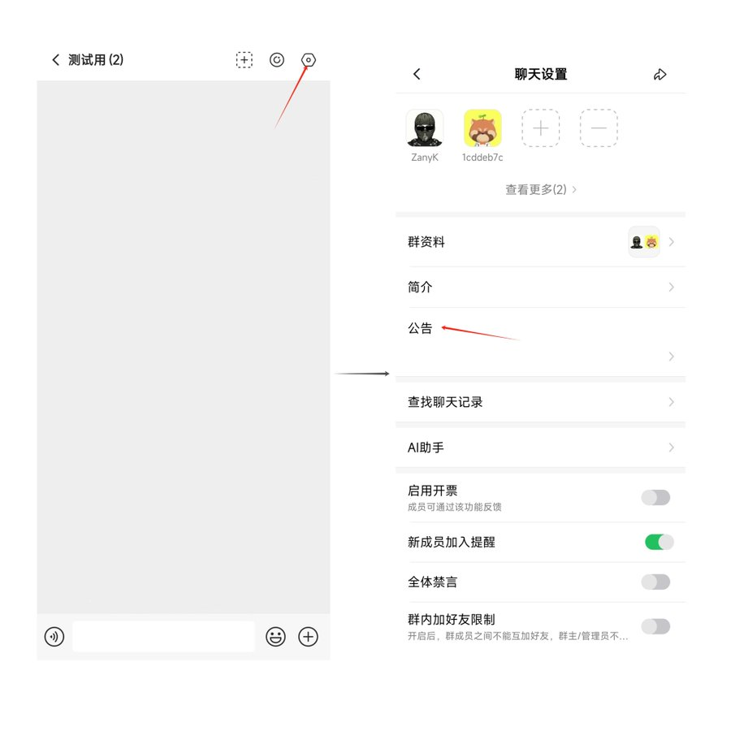
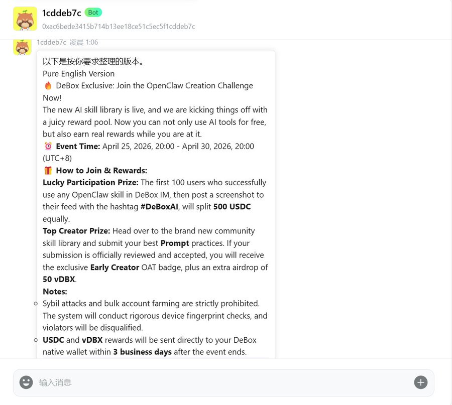
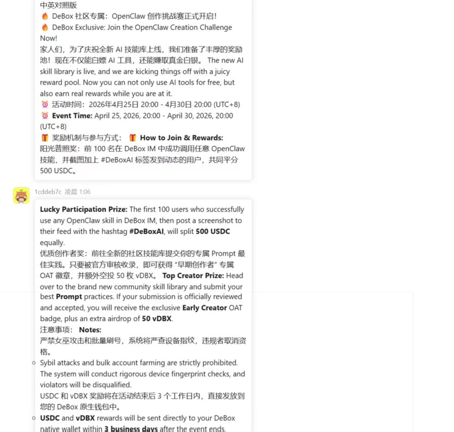
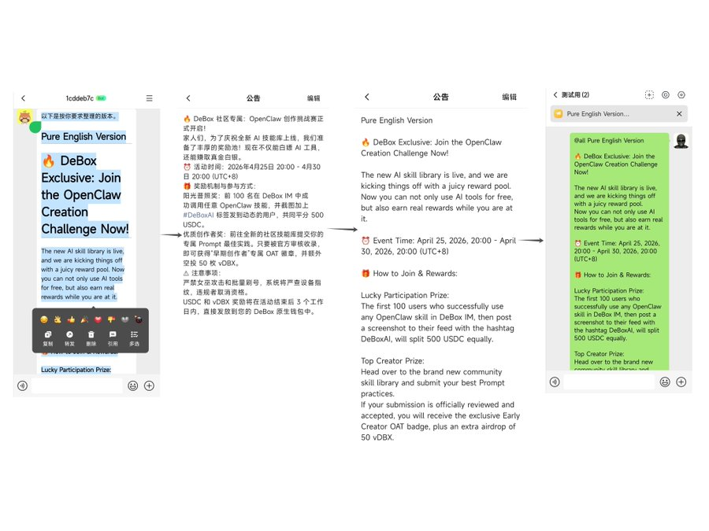

对于很多在 Web 3.0 、AI 或国际化的社区来说，做双语内容时怎么做得不别扭和契合实际场景，这是一个令人懊恼的问题。

中文内容写完之后，翻译成英文往往会遇到两个麻烦。

1、直译出来的句子很生硬，看起来像把中文硬搬过去的一样；

-   2、术语、项目名、活动信息一多，前后很容易不统一。表面上确实是做了内容同步，但用户读起来还是会感觉到割裂，甚至影响对项目专业度的判断。
    

最近我在 DeBox 里试了一个 Skill，叫 **Translate。**看它能不能在保留原文信息结构的前提下，输出一版更自然、更适合社区使用的英文内容。

Clawhub Skill 链接 :

[https://clawhub.ai/ivangdavila/translate](https://clawhub.ai/ivangdavila/translate)

我拿来测试的，是一篇典型的中文活动公告。这种文本非常适合做双语翻译测试，因为它同时包含了标题、活动主题、时间、参与方式、面向人群、奖励说明和一些注意事项。也就是说，它既有信息密度，又有一些品牌表达和社区语气，正好能测试翻译 Skill 是否真的可用。

在 DeBox 里，我给出的要求：

-   1、保留原有结构，不乱改专有名词，输出一版自然、清晰的英文稿；
    
-   2、同时，再给一版中英对照，方便我检查。因为对实际工作来说，最理想的流程不是直接无脑替换，而是先拿到一版质量较高的底稿，再做人工确认。
    
    

进入 DeBox 的社区群，找到公告板块，复制内容后，给配置好的 OpenClaw bot 发送指令。

我的 proment :

```plaintext
调用 Translate 技能。请将下方这篇【中文活动公告】翻译成地道、专业的英文 Web3 社区公告。

核心翻译要求：

拒绝机翻感：不要逐字硬翻。标题和开头请使用 Crypto 英文社区惯用的短平快表达（如带煽动性的祈使句），确保具备纯正的 “网感” 。

锁定专有名词：以下词汇绝对不可更改或翻译错位：DeBox, OpenClaw, USDC, vDBX, OAT, Prompt。

规则清晰化：中文里比较长的复杂句式，请在英文中主动拆解为清晰的短句，确保海外用户对 “时间节点、奖励机制、参与门槛” 的理解 100% 准确。

排版与格式：保持原有的 Markdown 结构、列表和 Emoji。

输出格式：请先输出完整的【纯英文版公告】，然后再输出一份按段落对应的【中英对照版】，方便我进行校对。

【中文活动公告】：
标题：🔥 DeBox 社区专属：OpenClaw 创作挑战赛正式开启！

家人们，为了庆祝全新 AI 技能库上线，我们准备了丰厚的奖励池！现在不仅能白嫖 AI 工具，还能赚取真金白银。

⏰ 活动时间：2026年4月25日 20:00 - 4月30日 20:00 (UTC+8)

🎁 奖励机制与参与方式：

阳光普照奖：前 100 名在 DeBox IM 中成功调用任意 OpenClaw 技能，并截图加上 #DeBoxAI 标签发到动态的用户，共同平分 500 USDC。

优质创作者奖：前往全新的社区技能库提交你的专属 Prompt 最佳实践。只要被官方审核收录，即可获得 “早期创作者” 专属 OAT 徽章，并额外空投 50 枚 vDBX。

注意事项：

严禁女巫攻击和批量刷号，系统将严查设备指纹，违规者取消资格。

USDC 和 vDBX 奖励将在活动结束后 3 个工作日内，直接发放到您的 DeBox 原生钱包中。
```



看结果时，我最先关注的是标题和活动说明。因为很多中文标题如果直译，英文会显得非常生硬，甚至有一点机器翻译的痕迹。

这次输出给我的感觉，就是它在大多数地方都没有死守字面意思，在尽量往该内容所相关的英文社区中常见的表达方式靠拢。

## **对外内容是否像一个真实在运营的国际社区会发出来的东西，这一点非常重要。**

最后我重点看了几类信息：时间表达、参与方式、报名说明、奖励相关描述，以及一些专有名词是否统一。因为这些地方最容易出错，也最容易在双语内容里造成混乱。

整体下来，Translate 这个 Skill 在 “保持结构” 和 “保证可读性” 这两件事之间，做得比较平衡。至少它给出的，不是一版只能参考一下的初稿，而是一版已经接近可用状态的内容底稿。



当然，我不会把它神化。比如活动名、品牌名、固定术语，我还是会自己再确认一遍；有些中文里的氛围型表达、情绪型表达，翻成英文时也未必需要逐句对应。

真正对外发布前，**人工过一遍仍然是必要的。尤其当内容涉及活动规则、奖励机制、时间节点时，最后的准确性检查不能省。**

从效率角度看，这类 Skill 还是有一定的价值。

尤其是类似 DeBox 这种既有中文用户、也会面对更广泛国际化语境的平台，双语内容不是锦上添花，而是基础设施的一部分。如果每次都从零来做，成本会很高；先用一个可用的翻译 Skill 快速打底，再做人工修正，整个内容的协作效率会提升一大截。

并且在 Debox 中，这一过程即为丝滑，当你校对无误后，可以立刻从 Bot 聊天框复制内容到群公告板块丝滑替换并在群内发布。只不过需要注意的是，目前 DeBox 群公告暂不支持 Markdown 格式，在 proment 部分增加限制返回纯文本格式即可。

小龙虾接入 DeBox 官方教程👇

[https://x.com/DeBox\_CN/status/2031953327102312855?s=20](https://x.com/DeBox_CN/status/2031953327102312855?s=20)

