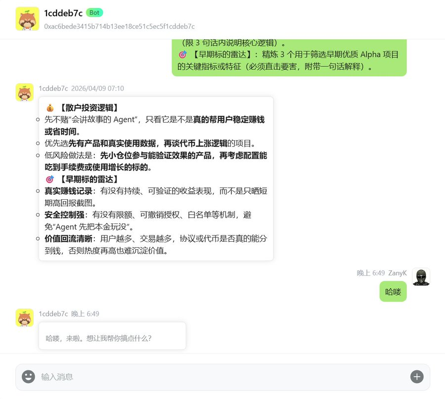
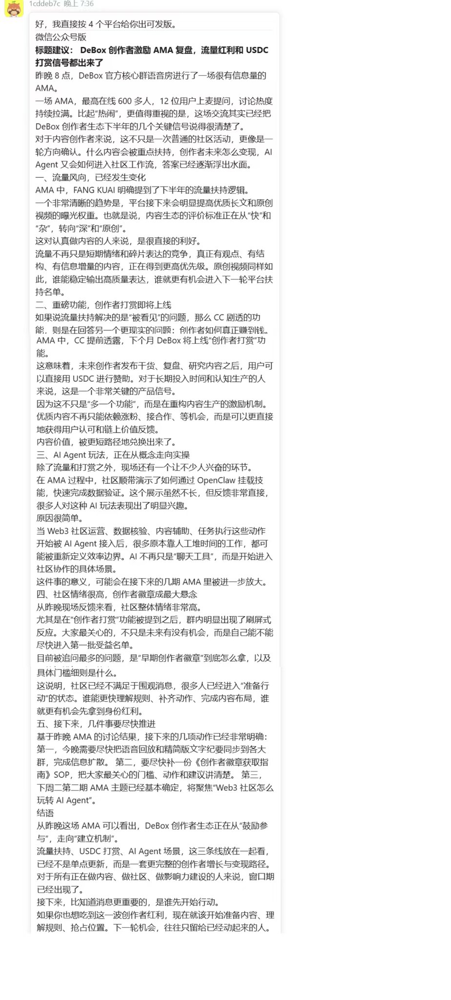
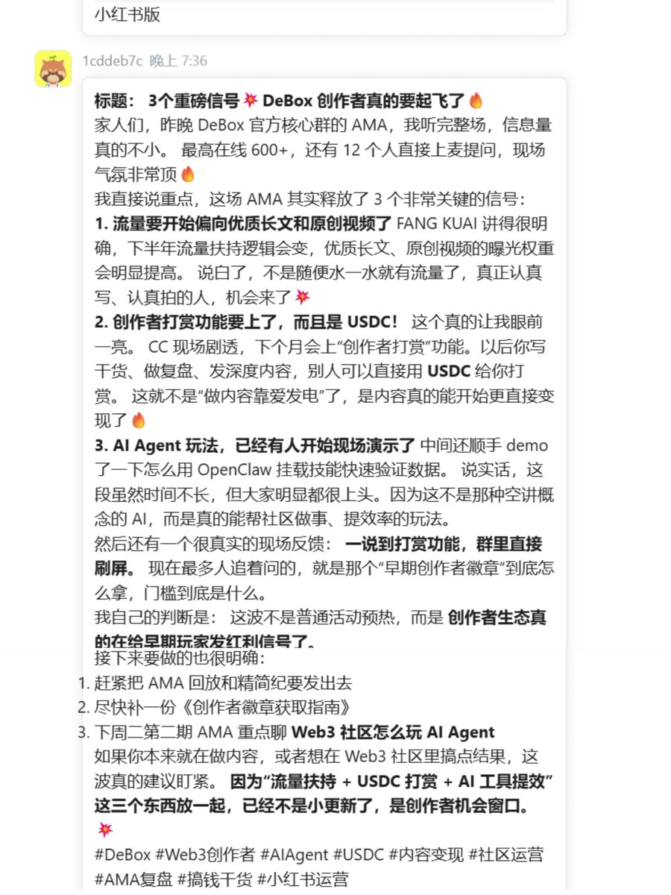
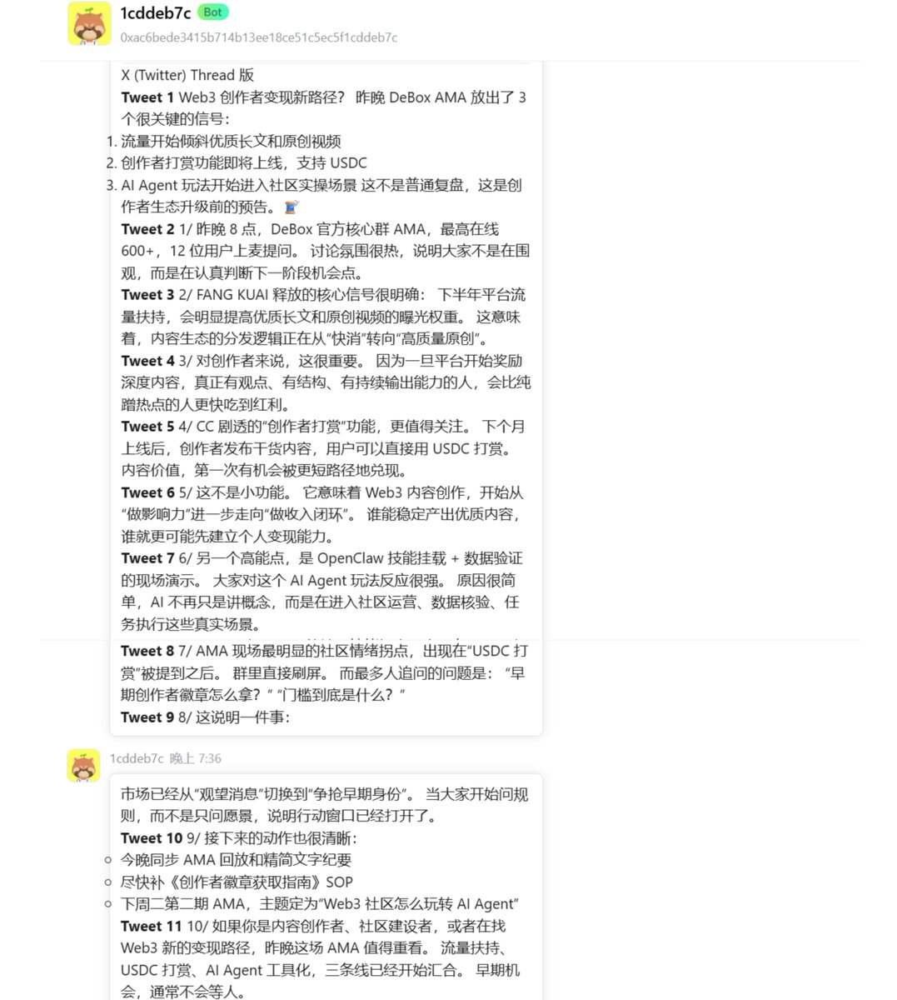
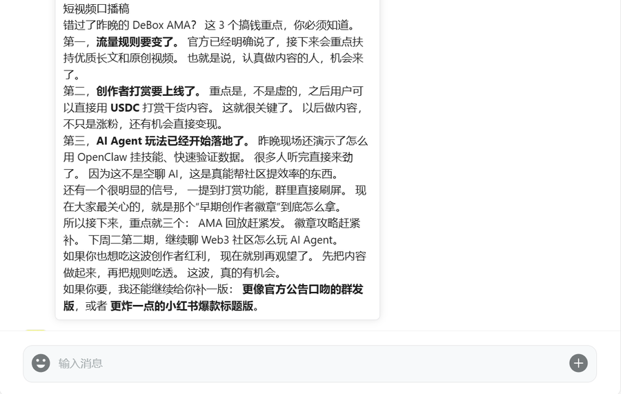

做 Web3 的社区运营，最折磨人的往往不是写不出东西，因为你可能要在无数个平台之间来回倒腾排版和语气。

比如刚刚在 DeBox Club 里办完一场高质量的 AMA，整理出了复盘原稿，然后发现痛苦才刚刚开始，发公众号需要拔高立意、理顺结构；发推特得精简提炼、加上抓人的 Hook；要是想顺手丢到小红书或者做成短视频，又得全篇改写成口语化的 “网感” 表达。真正耗干精力的，从来不是从 0 到 1 的创作，而是从 1 到 N 的重复搬砖。

最近我在 DeBox 里深度体验了 Content Rewriter

[https://clawhub.ai/alexandrali1989-cell/content-rewriter](https://clawhub.ai/alexandrali1989-cell/content-rewriter)

这个 skill 。它最懂运营人的地方就是它不教你做事，只帮你干活。

小龙虾接入 Debox 官方教程👇

[https://x.com/DeBox\_CN/status/2031953327102312855?s=20](https://x.com/DeBox_CN/status/2031953327102312855?s=20)



这次我拿了一篇常规的 DAO 社区活动复盘来测试。平时如果手动改写，至少得在不同文档里来回切半天。这次我直接在 DeBox 聊天框里把底稿扔给它，指令很直白：“把这份复盘，分别转化成适合公众号深度阅读、小红书体验分享、X Thread 连读以及短视频口播的四个版本。”

我的 proment :

```plaintext
调用 Content Rewriter 技能。请将以下的【原始复盘草稿】分别改写成适配 4 个不同平台的最终发布版本。

⚠️ 核心要求：绝对不要有 AI 的翻译腔或套话，请精准拿捏以下 4 个平台的原生语境：

📝 微信公众号版：注重结构和秩序感。生成引人入胜的开头和结语，使用清晰的高级小标题（如：流量风向、重磅功能），语气专业且带有官方号召力。

🍠 小红书版：网感拉满，极致口语化。强调“情绪价值”和“搞钱干货（重点提 USDC 打赏）”，多用 Emoji 💥🔥，采用“内幕分享/家人们”的口吻，拉近距离。

🐦 X (Twitter) Thread 版：极度强调信息密度和节奏。首条推文必须有一个极强的 Hook（比如：Web3 创作者变现新路径？），后续推文按 1/ 2/ 3/ 结构拆解，重点突出流量扶持和 AI Agent 玩法，字字珠玑。

🎬 短视频口播稿：绝对的口语化，不要任何书面语。开头3秒必须抓住注意力（“错过了昨晚的 DeBox AMA？这三个搞钱重点你必须知道…”），句子必须短促、顺嘴，不要长难句。

【原始复盘草稿】：
主题：DeBox 创作者激励第一期 AMA 内部复盘（草稿）
时间：昨晚8点
地点：DeBox 官方核心群语音房
数据：最高在线大概 600 多人，互动很燃，上麦提问的有 12 个。
核心讨论重点：

FANG KUAI 讲了下半年的流量扶持逻辑，明确了接下来优质长文和原创视频的曝光权重会大幅调高。

XX 提前剧透了下个月要上的 “创作者打赏” 功能，以后写干货能直接收 USDC 赞助了。

中间顺便演示了一下怎么用 OpenClaw 挂载技能来快速验证数据，大家对这个 AI 玩法特别感兴趣。
社区反馈：大家情绪很高，特别是听到打赏功能的时候群里刷屏了。目前最多人追问的是“早期创作者徽章”到底怎么拿，具体的门槛细则是什么。
后续待办：今晚得把语音回放和精简版文字纪要发到各大群；尽快补充一份《创作者徽章获取指南》的 SOP 文档；下周二准备第二期 AMA，主题就定“Web3 社区怎么玩转 AI Agent”。
```

结果非常符合预期，它精准抓住了不同平台的语境差异 。

**公众号版：** 自动拉开了文本结构。原本碎片的讨论被归纳成了带小标题的段落，直接建立起了适合长阅读的秩序感。



**小红书版：** 去掉了官方腔调，把生硬的事实陈述变成了 “参与感” 极强的体验分享，非常懂那种 “家人们谁懂啊” 的轻盈语境。



**X Thread 版：** 这个最让我惊喜。它不是简单的切分字数，而是懂得了社交媒体的 “节奏感” 。开头留悬念，中间给干货，单条信息密度极高，完美切中了推特用户的阅读习惯。



**口播脚本版：** 主动干掉了书面语，把句子改得非常顺嘴。对于需要快速产出宣发视频的团队来说，这能省下大把顺稿的时间。



当然，它不能百分百替代你最后的把关，比如带有强烈品牌调性的词汇我还是会微调一下。但这已经帮我把最繁杂的 80% 体力活给包揽了。

如果你每天都在为多平台分发头疼，建议你在 DeBox 里挂载这个技能试一下。运营人的时间很宝贵，把重复的改写交给 AI，把精力留给真正的社区互动。