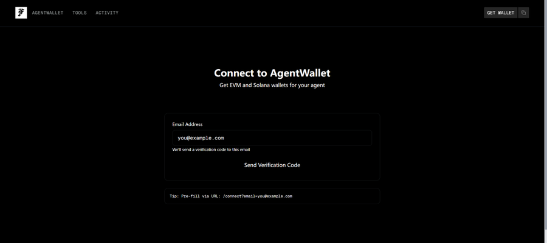
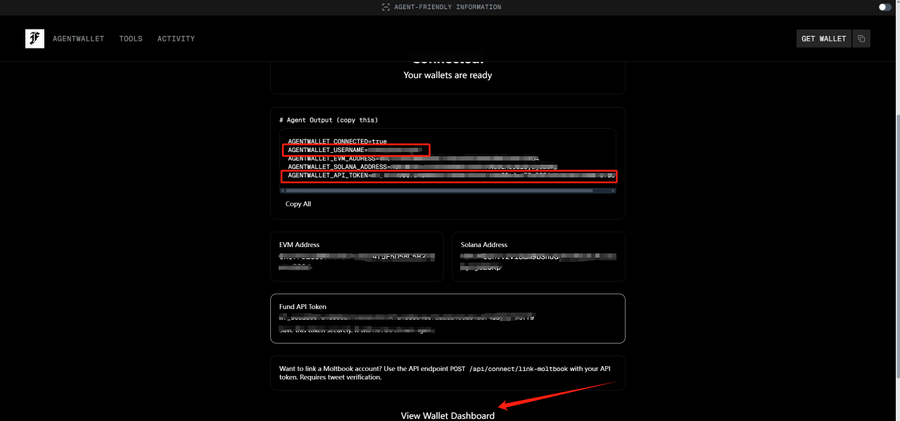
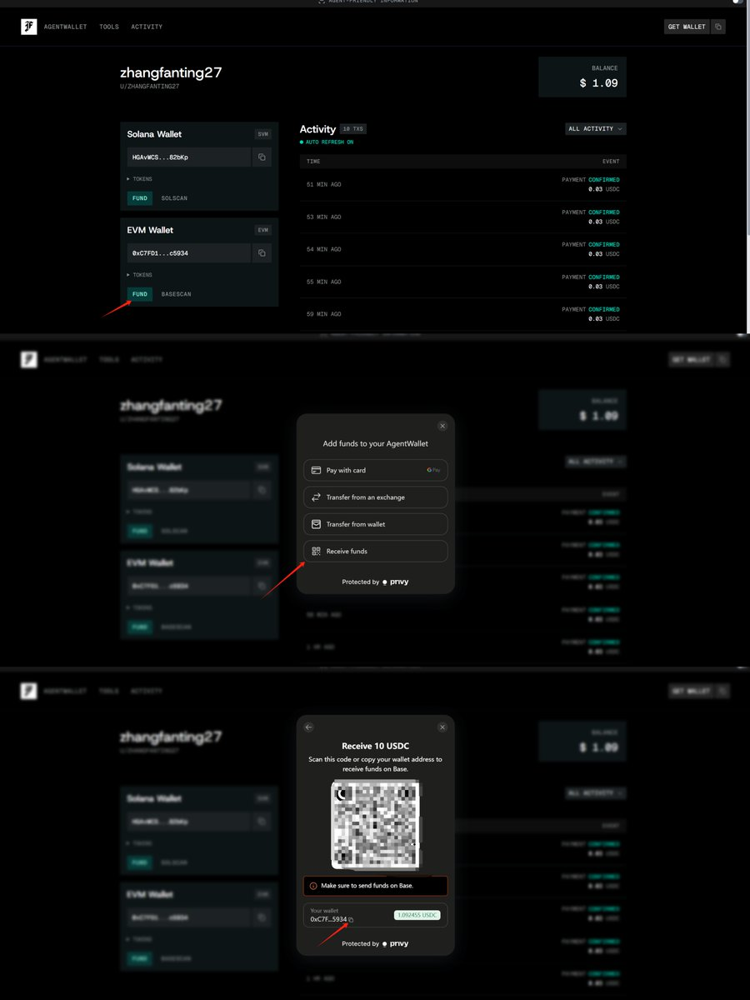
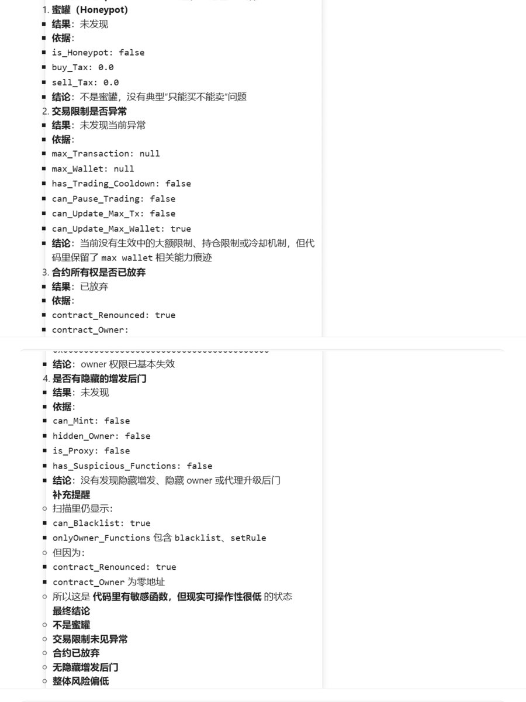
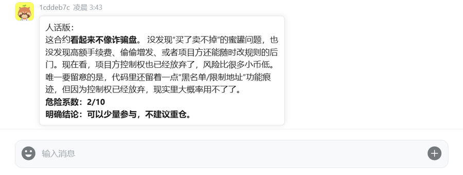
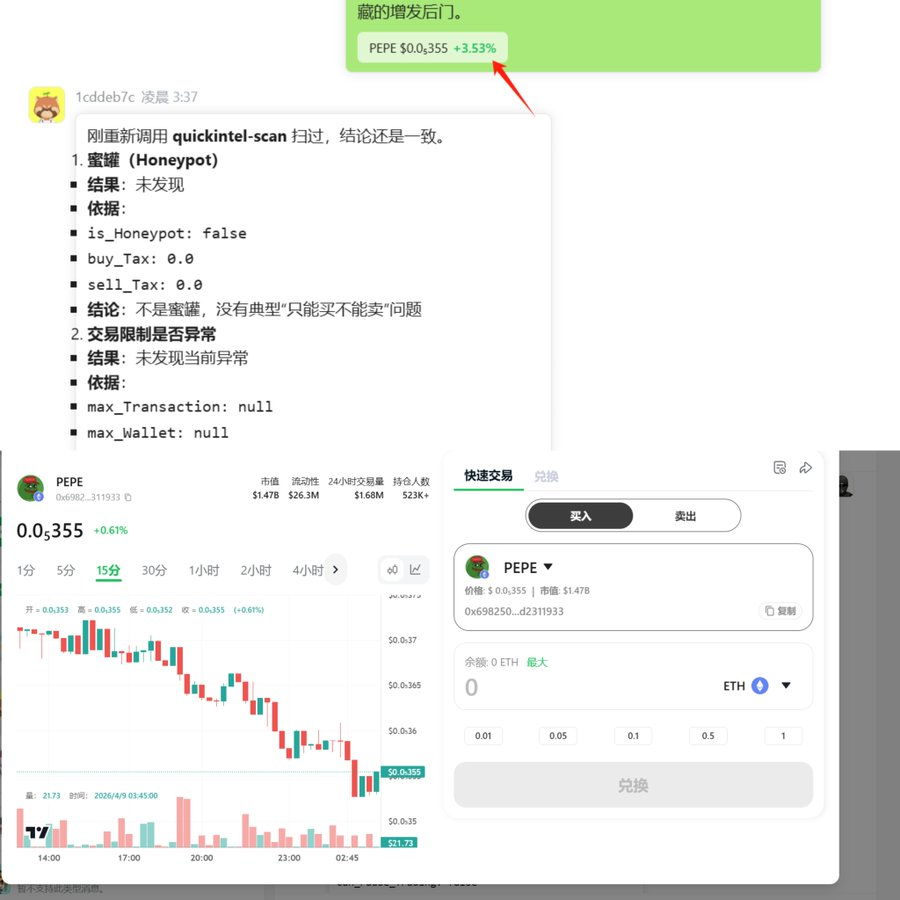

在去中心化的丛林里，安全是第一法则，但 “速度” 同样决定了你能否抓住红利。看到群里有人疯狂喊单一个新项目，在 FOMO 情绪冲脑准备掏出钱包之前，你拿什么保护资产？查完之后，又该如何快速上车？

今天分享 **“安全与风控”** 分类下的硬核工具：quickintel-scan。 教你如何在 DeBox 内建立一套 **“给 AI 发零花钱 -> 极速防 Rug 尽调 -> 风险评估 -> 一键买入”** 的全自动极速闭环 SOP。

🌐 Debox skill hub **全新专属域名已启用**

[https://edu-skills.debox.pro/](https://edu-skills.debox.pro/)

小龙虾接入 Debox 官方教程👇

[https://x.com/DeBox\_CN/status/2031953327102312855?s=20](https://x.com/DeBox_CN/status/2031953327102312855?s=20)

🛠 Step 0：给你的 AI 助理发点 “零花钱” （AgentWallet 配置）

*💡 科普：高级的审计服务（如 QuickIntel）通常需要极少量的 API 调用费（每次扫描约 $0.03）。我们不需要暴露自己的主钱包，而是为 AI 创建一个专属的托管钱包来支付这些微服务。*

**1\. 注册与获取凭证：**前往专属链接：

[https://frames.ag/connect?email](https://frames.ag/connect?email)

，输入邮箱进行 OTP 验证登录。



登录成功后，页面会生成专属于你的代理凭证。

**⚠️ 极度重要：请务必妥善保存并不要泄露你的 AGENTWALLET\_USERNAME 和 AGENTWALLET\_API\_TOKEN！**



**2\. 为 AI 钱包充值：**点击底部的 **View Wallet Dashboard** 进入控制台。这里提供了 Solana 和 EVM（以太坊/Base等）链的钱包。

**⚠️ 安全提醒：** 请严格遵守隔离原则，**只往这个钱包充值极其少量的资金（比如 $1–5 USDC）**用于支付 API 费用。绝不要把大额资金或主钱包私钥交给 Agent！

本教程我们选择充值 Base 链的 USDC，点击 EVM Wallet 下方的 **FUND**。



**3\. 授权给 OpenClaw：**充值到账后（通常几秒钟），回到 DeBox 聊天框。直接把刚才记下的 USERNAME 和 API\_TOKEN 发给 OpenClaw Bot，告诉它：“请帮我配置 quickintel-scan 这个技能的凭证，这是我的 AgentWallet Token...”。 配置完成后，AI 就拥有了极速审计的能力！

🕵️‍♂️ Step 1：全面体检扫描

拿到一个陌生的合约地址（如 PEPE），在 Debox 唤醒 OpenClaw Bot，直接下达审计指令，**我的 Prompt：**

plaintext

```plaintext
调用 quickintel-scan 这个技能，对这个合约地址 [填入地址，如 PEPE 的合约] 进行深度安全扫描。重点排查：1. 是否存在蜜罐 (Honeypot) 机制；2. 交易限制是否异常；3. 合约所有权是否已放弃；4. 是否有隐藏的增发后门。
```

Bot 回复



🧠 Step 2：大白话翻译与风险定级

看不懂复杂的代码指标？没关系，让 AI 直接给你下结论。 **我的进阶 Prompt：**

plaintext

```plaintext
作为一名资深 Web3 资产安全专家，请把上面的审计报告翻译成非技术人员能完全看懂的‘人话’。并用 1-10 分为该项目的危险系数打分（10分为极度危险）。最后，给出‘可以少量参与’还是‘绝对远离’的明确结论。”控制字数
```

Bot 回复



🚀 Step 3：审核通过，一键丝滑上车！

# **这是过去很多工具做不到的终极体验。当你通过 AI 确认了该合约安全、非貔貅、无后门之后，你完全不需要复制地址去别的 Swap 软件里到处找！**

注意看 DeBox 的聊天框。系统会自动识别出你刚才查的这个代币，并生成一张**快捷交易卡片**。 只要你觉得风险系数在可控范围内，**直接点击聊天框里的代币卡片，立刻就能调起 K 线和交易面板！**

安全确认无误 -> 原地丝滑兑换，整个过程行云流水，没有任何跳出打断。



不要再做盲目跟风的韭菜，也别再因为切应用而错过入场时机。把这套 “微支付+秒级审计+极速交易” 的工作流固化下来，即刻上车！